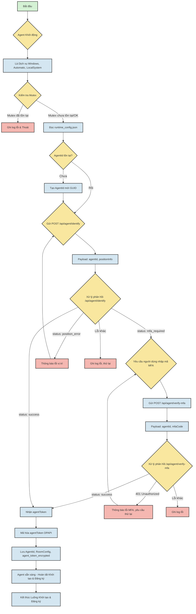
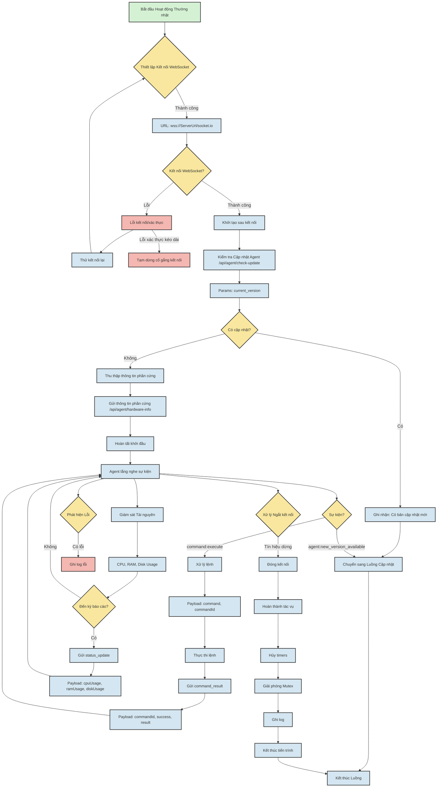

# Computer Management System Agent Flow Documentation

## 1. Agent Initialization and Registration Flow

```mermaid
flowchart TD
    %% Style definitions
    classDef default fill:#f9f9f9,stroke:#333,stroke-width:2px,color:#333,font-size:14px
    classDef start fill:#d4f1d4,stroke:#333,stroke-width:2px,color:#333,font-size:14px
    classDef process fill:#d4e6f1,stroke:#333,stroke-width:2px,color:#333,font-size:14px
    classDef decision fill:#f9e79f,stroke:#333,stroke-width:2px,color:#333,font-size:14px
    classDef error fill:#f5b7b1,stroke:#333,stroke-width:2px,color:#333,font-size:14px

    %% Main flow
    A[Bắt đầu]:::start --> B{Agent Khởi động}:::decision
    B --> B1[Là Dịch vụ Windows, Automatic, LocalSystem]:::process
    B1 --> B2{Kiểm tra Mutex}:::decision
    B2 -- Mutex đã tồn tại --> B3[Ghi log lỗi & Thoát]:::error
    B2 -- Mutex chưa tồn tại/OK --> C[Đọc runtime_config.json]:::process
    
    %% Agent ID check
    C --> C1{AgentId tồn tại?}:::decision
    C1 -- Chưa --> C2[Tạo AgentId mới GUID]:::process
    C1 -- Rồi --> D
    C2 --> D{Gửi POST /api/agent/identify}:::decision
    
    %% Identify flow
    D --> D_Payload[Payload: agentId, positionInfo]:::process
    D_Payload --> E{Xử lý phản hồi /api/agent/identify}:::decision
    
    %% MFA flow
    E -- status: mfa_required --> F{Yêu cầu người dùng nhập mã MFA}:::decision
    F --> G[Gửi POST /api/agent/verify-mfa]:::process
    G --> G_Payload[Payload: agentId, mfaCode]:::process
    G_Payload --> H{Xử lý phản hồi /api/agent/verify-mfa}:::decision
    
    %% Response handling
    H -- status: success --> I[Nhận agentToken]:::process
    H -- 401 Unauthorized --> H_Error[Thông báo lỗi MFA, yêu cầu thử lại]:::error
    H_Error --> F
    H -- Lỗi khác --> H_Error_Other[Ghi log lỗi]:::error
    
    %% Success path
    E -- status: success --> I
    E -- status: position_error --> E_PosError[Thông báo lỗi vị trí]:::error
    E_PosError --> D
    E -- Lỗi khác --> E_Error_Other[Ghi log lỗi, thử lại]:::error
    
    %% Final steps
    I --> J[Mã hóa agentToken DPAPI]:::process
    J --> K[Lưu AgentId, RoomConfig, agent_token_encrypted]:::process
    K --> L[Agent sẵn sàng - Hoàn tất Khởi tạo & Đăng ký]:::process
    L --> Z[Kết thúc Luồng Khởi tạo & Đăng ký]:::process
```

## 2. Agent Daily Operation Flow

```mermaid
flowchart TD
    %% Style definitions
    classDef default fill:#f9f9f9,stroke:#333,stroke-width:2px,color:#333,font-size:14px
    classDef start fill:#d4f1d4,stroke:#333,stroke-width:2px,color:#333,font-size:14px
    classDef process fill:#d4e6f1,stroke:#333,stroke-width:2px,color:#333,font-size:14px
    classDef decision fill:#f9e79f,stroke:#333,stroke-width:2px,color:#333,font-size:14px
    classDef error fill:#f5b7b1,stroke:#333,stroke-width:2px,color:#333,font-size:14px

    AA[Bắt đầu Hoạt động Thường nhật]:::start
    AA --> AB{Thiết lập Kết nối WebSocket}:::decision
    AB -->|Thành công| AC[URL: wss://ServerUrl/socket.io]:::process
    AC --> AD{Kết nối WebSocket?}:::decision
    AD -->|Thành công| AE[Khởi tạo sau kết nối]:::process
    AD -->|Lỗi| AF[Lỗi kết nối/xác thực]:::error
    AF --> AG[Thử kết nối lại]:::process
    AG --> AB
    AF -->|Lỗi xác thực kéo dài| AH[Tạm dừng cố gắng kết nối]:::error

    %% Post-connection initialization (vertical grouping)
    AE --> BA[Kiểm tra Cập nhật Agent /api/agent/check-update]:::process
    BA --> BB[Params: current_version]:::process
    BB --> BC{Có cập nhật?}:::decision
    BC -->|Có| BD[Ghi nhận: Có bản cập nhật mới]:::process
    BD --> BE[Chuyển sang Luồng Cập nhật]:::process
    BC -->|Không| BF[Thu thập thông tin phần cứng]:::process
    BF --> BI[Gửi thông tin phần cứng /api/agent/hardware-info]:::process
    BI --> BL[Hoàn tất khởi đầu]:::process

    %% Main operation loop (vertical)
    BL --> CA[Agent lắng nghe sự kiện]:::process
    CA --> CB{Sự kiện?}:::decision
    CB -->|agent:new_version_available| BE
    CB -->|command:execute| CC[Xử lý lệnh]:::process
    CC --> CD[Payload: command, commandId]:::process
    CD --> CE[Thực thi lệnh]:::process
    CE --> CF[Gửi command_result]:::process
    CF --> CG[Payload: commandId, success, result]:::process
    CG --> CA

    %% Resource monitoring (vertical)
    CA --> DA[Giám sát Tài nguyên]:::process
    DA --> DB[CPU, RAM, Disk Usage]:::process
    DB --> DC{Đến kỳ báo cáo?}:::decision
    DC -->|Có| DD[Gửi status_update]:::process
    DD --> DE[Payload: cpuUsage, ramUsage, diskUsage]:::process
    DE --> CA
    DC -->|Không| CA

    %% Error handling (vertical)
    CA --> EA{Phát hiện Lỗi}:::decision
    EA -->|Có lỗi| EE[Ghi log lỗi]:::error

    %% Shutdown handling (vertical)
    CA --> FA{Xử lý Ngắt kết nối}:::decision
    FA -->|Tín hiệu dừng| FB[Đóng kết nối]:::process
    FB --> FC[Hoàn thành tác vụ]:::process
    FC --> FD[Hủy timers]:::process
    FD --> FE[Giải phóng Mutex]:::process
    FE --> FF[Ghi log]:::process
    FF --> FG[Kết thúc tiến trình]:::process

    %% Flow end points
    BE --> HZ[Kết thúc Luồng]:::process
    FG --> HZ
```

## 3. Agent Auto-Update Flow

```mermaid
flowchart TD
    %% Style definitions
    classDef default fill:#f9f9f9,stroke:#333,stroke-width:2px,color:#333,font-size:14px
    classDef start fill:#d4f1d4,stroke:#333,stroke-width:2px,color:#333,font-size:14px
    classDef process fill:#d4e6f1,stroke:#333,stroke-width:2px,color:#333,font-size:14px
    classDef decision fill:#f9e79f,stroke:#333,stroke-width:2px,color:#333,font-size:14px
    classDef error fill:#f5b7b1,stroke:#333,stroke-width:2px,color:#333,font-size:14px

    %% Entry points from Agent Daily Operation Flow
    FLOW2_CHECK_UPDATE[Kiểm tra Cập nhật từ Agent Daily Operation]:::process --> BA
    FLOW2_EVENT[agent:new_version_available từ Agent Daily Operation]:::process --> BA

    %% Start update process
    BA[Bắt đầu Luồng Cập nhật]:::start --> BE[Nhận thông tin cập nhật]:::process
    BE --> BE_Data[Data: version, download_url]:::process
    BE_Data --> BF{Tải Gói Cập nhật}:::decision
    BF --> BF_Action[GET download_url]:::process
    BF_Action --> BG{Tải thành công?}:::decision
    BG -- Không --> BH[Báo lỗi DownloadFailed]:::error
    BH --> BZ_End[Kết thúc]:::process
    BG -- Có --> BI{Xác minh Checksum}:::decision
    BI --> BJ{Checksum khớp?}:::decision
    BJ -- Không --> BK[Báo lỗi ChecksumMismatch]:::error
    BK --> BZ_End
    BJ -- Có --> BL{Giải nén}:::decision
    BL --> BL_Action[Giải nén vào updates]:::process
    BL_Action --> BM{Giải nén thành công?}:::decision
    BM -- Không --> BN[Báo lỗi ExtractionFailed]:::error
    BN --> BZ_End
    BM -- Có --> BO{Khởi chạy Updater}:::decision
    BO --> BO_Params[Truyền tham số]:::process
    BO_Params --> BP{Khởi chạy thành công?}:::decision
    BP -- Không --> BQ[Báo lỗi UpdateLaunchFailed]:::error
    BQ --> BZ_End
    BP -- Có --> BR[Agent Cũ Dừng]:::process

    %% Updater process
    BR --> SUB_UPDATER[Luồng CMSUpdater]:::process
    subgraph "Luồng CMSUpdater"
        direction TB
        UPDATER_A[Bắt đầu]:::start --> UPDATER_B[Ghi Log]:::process
        UPDATER_B --> UPDATER_C{Dừng Service Cũ}:::decision
        UPDATER_C --> UPDATER_C1[Gọi sc.exe stop CMSAgentService]:::process
        UPDATER_C1 --> UPDATER_C2{Đợi Service Dừng}:::decision
        UPDATER_C2 -- Timeout --> UPDATER_C3[Báo lỗi]:::error
        UPDATER_C2 -- Thành công --> UPDATER_D[Sao lưu]:::process
        UPDATER_D --> UPDATER_E[Thay thế File]:::process
        UPDATER_E --> UPDATER_F{Khởi động Mới}:::decision
        UPDATER_F -- Thành công --> UPDATER_H{Watchdog}:::decision
        UPDATER_H -- Ổn định --> UPDATER_J[Dọn dẹp]:::process
        UPDATER_J --> UPDATER_K[Thoát]:::process
        UPDATER_F -- Lỗi --> UPDATER_G{Rollback}:::decision
        UPDATER_G --> UPDATER_G1[Báo lỗi]:::error
        UPDATER_G1 --> UPDATER_K
        UPDATER_H -- Crash --> UPDATER_I{Rollback}:::decision
        UPDATER_I --> UPDATER_I1[Báo lỗi]:::error
        UPDATER_I1 --> UPDATER_K
    end

    %% Post-update verification
    SUB_UPDATER --> BS{Agent Mới Khởi động}:::decision
    BS -- Kết nối WS --> BT[Server xác nhận]:::process
    BS -- Lỗi --> BU[Báo lỗi]:::error
    
    %% Error handling
    BZ_End_CheckUpdate[Kiểm tra Lỗi]:::process
    BZ_End_CheckUpdate -- Bỏ qua --> BZ_End
    BT --> BZ_End_CheckUpdate
    BU --> BZ_End_CheckUpdate
    
    BZ_End
```
