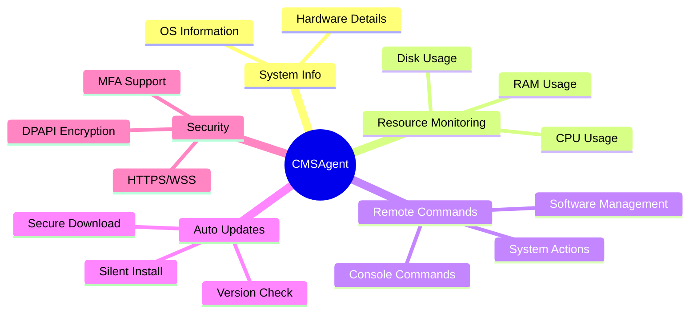

# CMSAgent

A robust Windows service agent for comprehensive computer management and monitoring

## 📋 Table of Contents

- [CMSAgent](#cmsagent)
  - [📋 Table of Contents](#-table-of-contents)
  - [1. Introduction](#1-introduction)
  - [2. Key Features](#2-key-features)
  - [3. System Requirements](#3-system-requirements)
    - [Operating System](#operating-system)
    - [Platform](#platform)
  - [4. Installation](#4-installation)
  - [5. Initial Configuration](#5-initial-configuration)
  - [6. Server Communication](#6-server-communication)
    - [HTTP/HTTPS Endpoints](#httphttps-endpoints)
    - [WebSocket (WSS via Socket.IO)](#websocket-wss-via-socketio)
  - [7. Automatic Updates](#7-automatic-updates)
    - [Update Trigger](#update-trigger)
    - [Update Process](#update-process)
  - [8. Command Line Interface (CLI)](#8-command-line-interface-cli)
  - [9. Main Directories](#9-main-directories)
    - [Installation Directory](#installation-directory)
    - [Data Directory](#data-directory)

## 1. Introduction

CMSAgent is a background service running on client computers, designed to collect system information, monitor resources, execute remote commands, and perform automatic updates. This agent is a component of the Computer Management System (CMS), communicating with a central Server to receive instructions and send data.

## 2. Key Features

- **System Information Collection**: Automatically collects details about hardware (CPU, GPU, RAM, drives) and operating system.

- **Resource Monitoring**: Real-time tracking of CPU, RAM, and disk usage.

- **Remote Command Execution**: Receives and executes commands from the Server, including:
  - Console commands (CMD, PowerShell)
  - System actions (Restart, Shutdown, Logout)
  - Software Installation/Uninstallation (silent mode)
  - Log file collection

- **Automatic Updates**: Automatically downloads and installs new agent versions when available from the Server.

- **Secure Communication**: Uses HTTPS and WSS (WebSocket Secure) for all Server communications.

- **Windows Service Operation**: Runs automatically on Windows startup with LocalSystem account.

- **Single Instance Enforcement**: Prevents multiple copies of the agent from running simultaneously.

- **Detailed Logging**: Records activities and errors to files and Windows Event Log.

## 3. System Requirements

### Operating System
- Windows 10 (version 1903 or later, 64-bit)
- Windows 11 (64-bit)
- Windows Server 2016, 2019, 2022 (64-bit)

### Platform
- .NET 8 LTS (Agent is packaged self-contained, no separate .NET Runtime installation required)
- Architecture: win-x64

## 4. Installation

The agent is installed via a `Setup.CMSAgent.vX.Y.Z.exe` file. The installation process will:

1. Require Administrator privileges
2. Extract necessary files to `C:\Program Files\CMSAgent`
3. Create data directories in `C:\ProgramData\CMSAgent`:
   - `logs`: Agent and updater log files
   - `runtime_config`: Configuration files
   - `updates`: Update-related files
   - `error_reports`: Error report files
4. Register `CMSAgentService` as a Windows Service, set to Automatic startup
5. Register Event Log source
6. Run `CMSAgent.Service.exe configure` for initial configuration

## 5. Initial Configuration

After installation, `CMSAgent.Service.exe configure` will be executed to:

1. Create or read AgentId (unique identifier for the agent)
2. Request user input for machine location information (Room Name, X, Y coordinates)
3. Send identification information to Server (POST `/api/agent/identify`)
4. If required by Server, perform Multi-Factor Authentication (MFA)
5. Save configuration to `C:\ProgramData\CMSAgent\runtime_config\runtime_config.json`
6. Start the CMSAgentService

## 6. Server Communication

### HTTP/HTTPS Endpoints
- `/api/agent/identify`: Agent identification
- `/api/agent/verify-mfa`: MFA verification
- `/api/agent/hardware-info`: Hardware information submission
- `/api/agent/check-update`: Update checks
- `/api/agent/report-error`: Error reporting
- `/download/agent-packages/:filename`: Package downloads

### WebSocket (WSS via Socket.IO)
- Connection: `wss://<server_url>/socket.io`
- Events sent by agent:
  - `agent:status_update`
  - `agent:command_result`
- Events received by agent:
  - `command:execute`
  - `agent:new_version_available`

## 7. Automatic Updates

### Update Trigger
- Periodic checks via GET `/api/agent/check-update`
- Or when receiving `agent:new_version_available` event

### Update Process
1. **CMSAgent.Service**:
   - Download update package (.zip)
   - Verify SHA256 checksum
   - Extract to temporary directory
   - Launch CMSUpdater.exe
   - Self-terminate

2. **CMSUpdater.exe**:
   - Wait for old agent to stop
   - Backup current version
   - Install new files
   - Start new version
   - Rollback if needed
   - Clean up

## 8. Command Line Interface (CLI)

`CMSAgent.Service.exe` supports the following commands:

- `configure`: Perform or reconfigure agent
- `debug`: Run agent in current console for debugging

## 9. Main Directories

### Installation Directory
`C:\Program Files\CMSAgent\`

### Data Directory
`C:\ProgramData\CMSAgent\`
- `logs\`: Contains agent and updater log files
- `runtime_config\`: Contains runtime_config.json
- `updates\`: Contains files related to update process
- `error_reports\`: Contains detailed error report files

---

  
Built with ❤️ for efficient computer lab management

