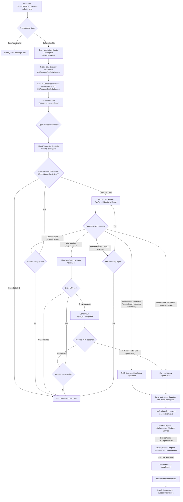
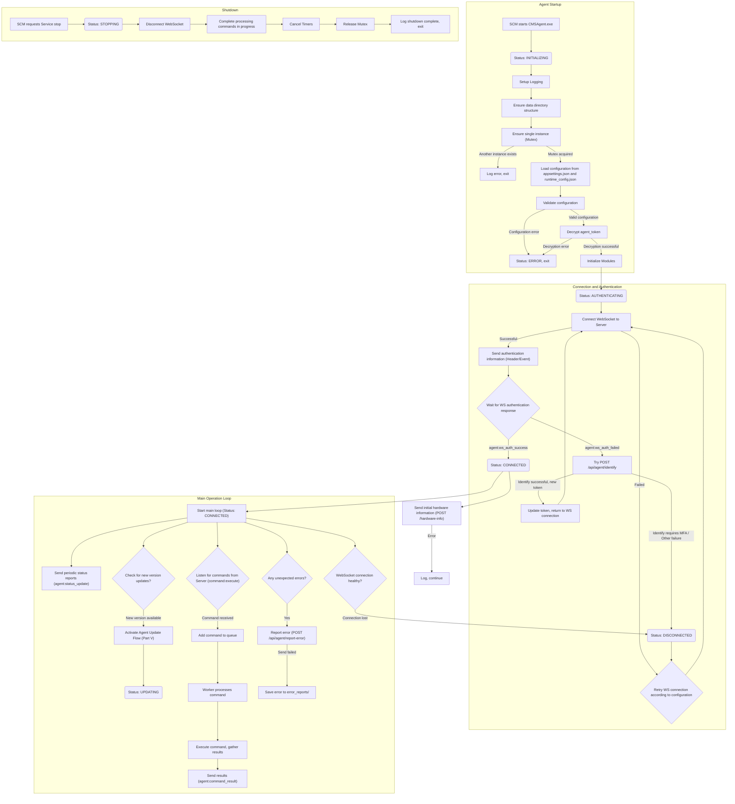
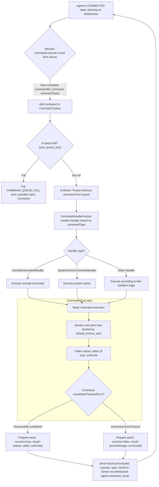
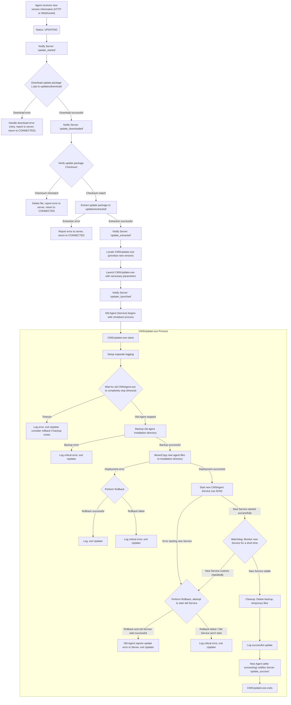
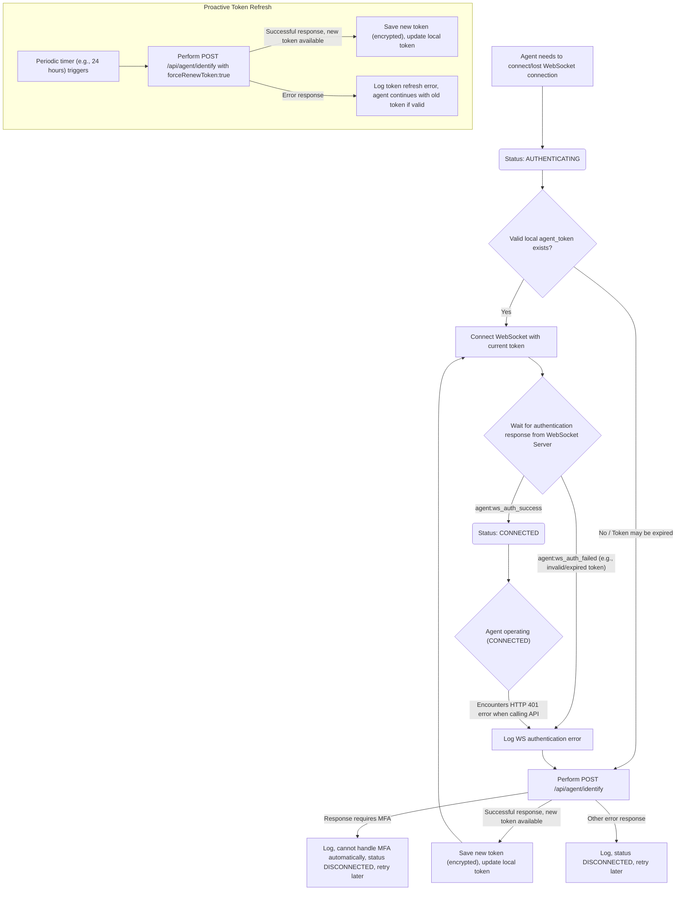

# CMSAgent Flow Diagrams

This section provides flowcharts describing the main operational processes of CMSAgent, based on "CMSAgent Comprehensive Documentation v7.4" and "CMSAgent System Architecture". The diagrams are presented using Mermaid syntax.

## 1. Installation and Initial Configuration Flow (Part III - Comprehensive Documentation)

## 2. Regular Agent Operation Flow (Part IV - Comprehensive Documentation)

## 3. Server Command Processing Flow (Part IV.10 - Comprehensive Documentation)

## 4. Agent Update Flow (Part V - Comprehensive Documentation)

## 5. WebSocket Authentication and Token Refresh Flow (Part IV.9, VIII.6 - Comprehensive Documentation)

