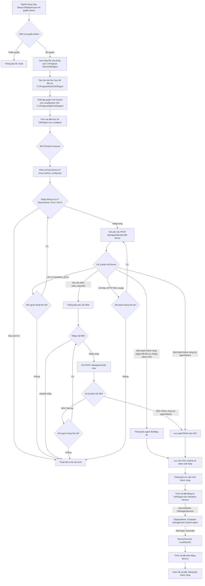
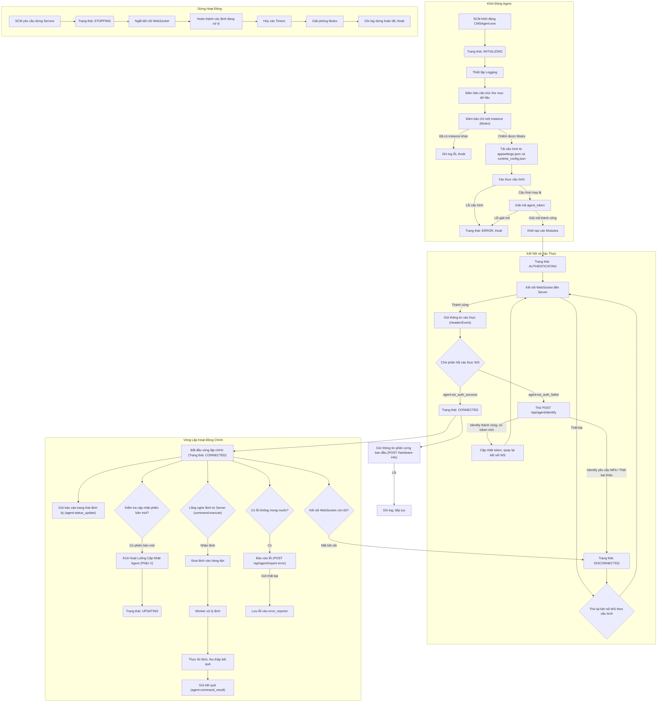
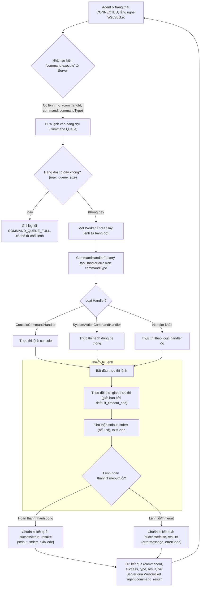
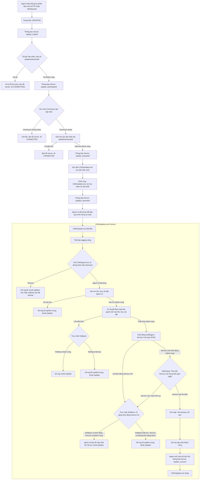
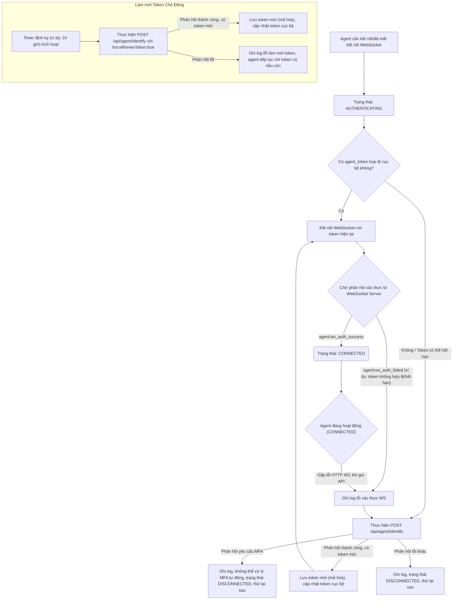

# Sơ đồ Luồng Hoạt động CMSAgent

Phần này cung cấp các sơ đồ luồng (flowcharts) mô tả các quy trình hoạt động chính của CMSAgent, dựa trên "Tài liệu Toàn Diện CMSAgent v7.4" và "Kiến trúc Hệ thống CMSAgent". Các sơ đồ được biểu diễn bằng cú pháp Mermaid.

## 1. Luồng Cài đặt và Cấu Hình Ban Đầu (Phần III - Tài liệu Toàn Diện)

## 2. Luồng Hoạt động Thường Xuyên của Agent (Phần IV - Tài liệu Toàn Diện)

## 3. Luồng Xử lý Lệnh từ Server (Phần IV.10 - Tài liệu Toàn Diện)

## 4. Luồng Cập nhật Agent (Phần V - Tài liệu Toàn Diện)

## 5. Luồng Xác thực WebSocket và Làm mới Token (Phần IV.9, VIII.6 - Tài liệu Toàn Diện)

