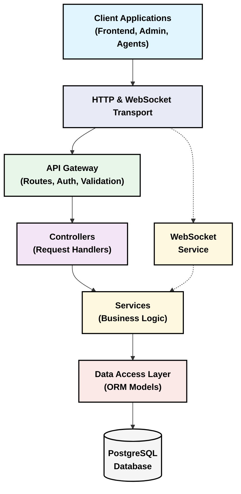
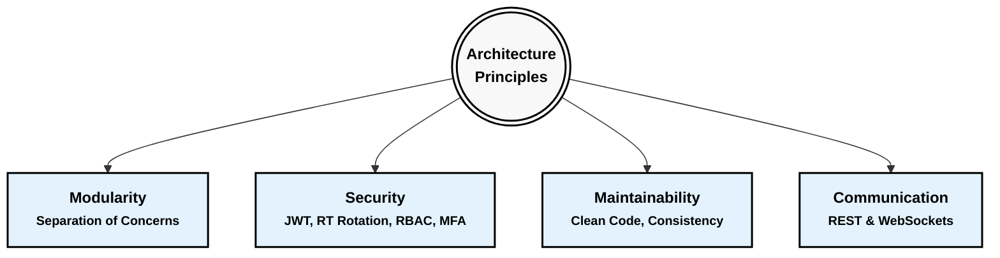
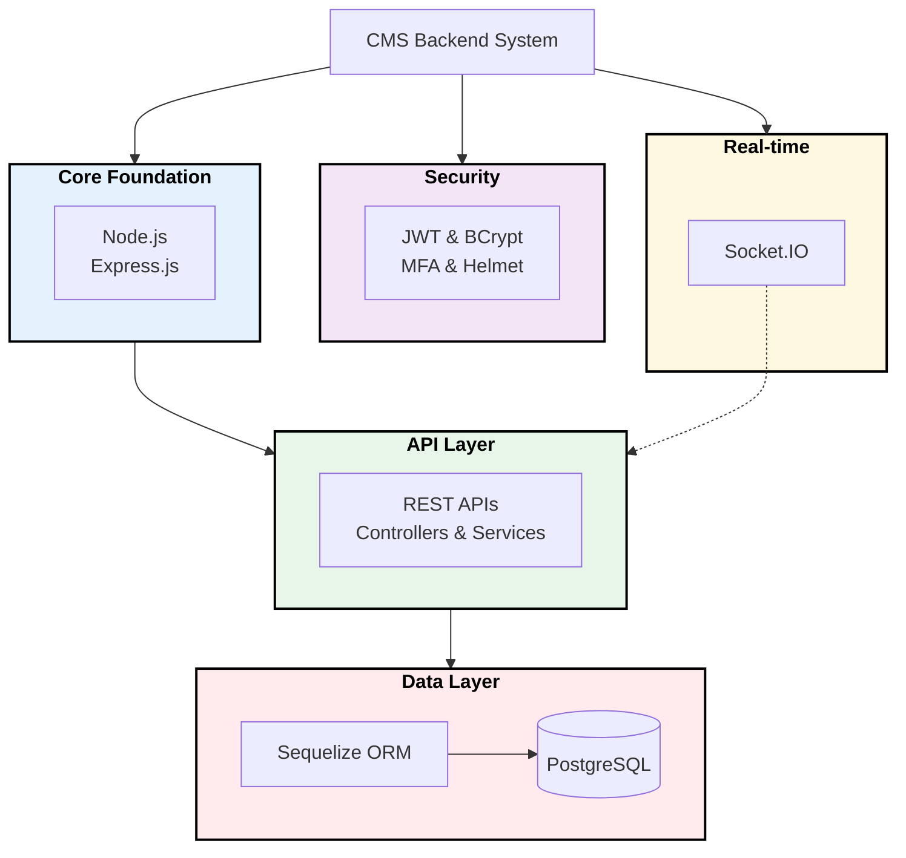
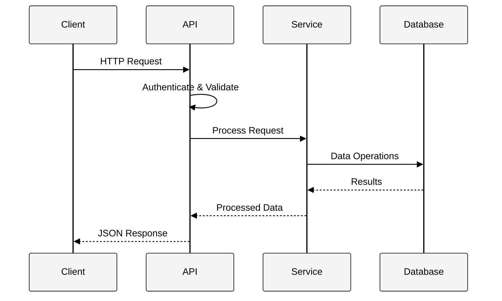
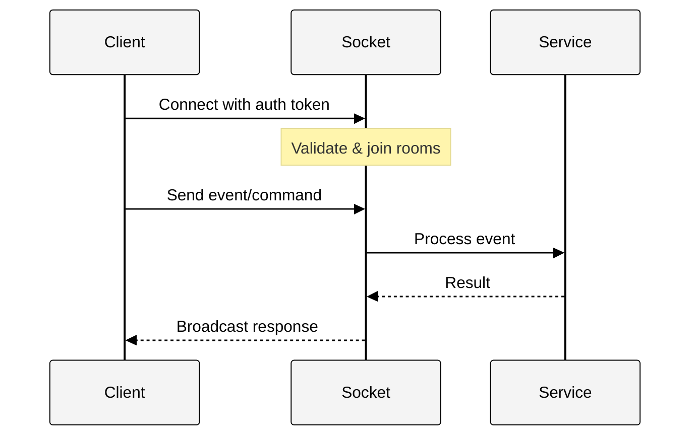
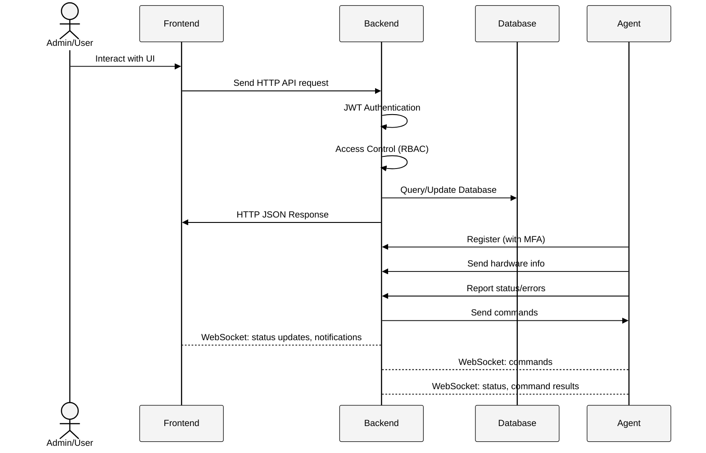

# Computer Management System - Backend

<div align="center">


A robust backend system for comprehensive computer management across multiple locations
</div>

## 📋 Table of Contents

- [Computer Management System - Backend](#computer-management-system---backend)
  - [📋 Table of Contents](#-table-of-contents)
  - [Overview](#overview)
  - [Core Architecture](#core-architecture)
    - [🏗️ Layered Architecture Overview](#️-layered-architecture-overview)
    - [Key Architecture Principles](#key-architecture-principles)
    - [Technology Stack](#technology-stack)
      - [🔧 Core Technologies](#-core-technologies)
      - [🌐 Layer Structure](#-layer-structure)
    - [Core Components](#core-components)
    - [Basic Request Flow](#basic-request-flow)
    - [WebSocket Communication](#websocket-communication)
  - [Main Operational Flow](#main-operational-flow)
  - [Detailed Features](#detailed-features)
    - [1. Authentication \& Authorization](#1-authentication--authorization)
    - [2. User Management - `/api/users`](#2-user-management---apiusers)
    - [3. Room Management - `/api/rooms`](#3-room-management---apirooms)
    - [4. Computer/Agent Management](#4-computeragent-management)
    - [5. Agent Version Management (Admin) - `/api/admin/agents/versions`](#5-agent-version-management-admin---apiadminagentsversions)
    - [6. WebSocket Communication (`/socket.io`)](#6-websocket-communication-socketio)
    - [7. System Statistics (Admin) - `/api/admin/stats`](#7-system-statistics-admin---apiadminstats)
    - [8. Logging](#8-logging)
    - [9. Configuration and Environment](#9-configuration-and-environment)
    - [10. Database](#10-database)
  - [Prerequisites](#prerequisites)
  - [Installation and Setup](#installation-and-setup)
  - [Running the Application](#running-the-application)
  - [API Documentation](#api-documentation)
  - [Directory Structure](#directory-structure)
  - [Contributing](#contributing)
  - [License](#license)

## Overview

The backend of the Computer Management System (CMS) is a robust and scalable Node.js application, designed to serve as a central control, monitoring, and management hub for a network of computers (agents) deployed across various rooms or locations. The backend's architecture is modular, adhering to the principle of separation of concerns to ensure maintainability, ease of development, and high testability. Key components such as HTTP request handling, business logic, database access, and real-time communication are clearly demarcated.

## Core Architecture

<div align="center">

### 🏗️ Layered Architecture Overview

</div>

The CMS backend uses a clean layered architecture that separates concerns, making the system easy to maintain and extend.

<div align="center">



</div>

### Key Architecture Principles

<div align="center">



</div>

### Technology Stack

<div align="center">



</div>

<div align="center">

#### 🔧 Core Technologies

</div>

| Group | Key Technologies | Role |
|------|-----------------|---------|
| **Foundation** | Node.js, Express.js, PM2 | JavaScript runtime, Web framework, Process manager |
| **Database** | PostgreSQL, Sequelize | Relational database, ORM with migrations and models |
| **Authentication & Security** | JWT, Selector/Verifier RT, BCrypt, Helmet, OTP | Token authentication, Secure refresh token rotation, Password encryption, HTTP security, MFA |
| **Real-time** | Socket.IO | Bidirectional real-time communication |
| **Utilities** | Winston, Dotenv, Node-Cache | Logging, Environment configuration, In-memory cache |

<div align="center">

#### 🌐 Layer Structure

</div>

The system is organized in a clear multi-layered architecture:

- **API & Controllers**: Handle requests and distribute to services
- **Business Logic**: Implement business logic in services
- **Data Access**: Query and manipulate data through ORM
- **Security**: Authentication, authorization, and API security
- **WebSocket**: Real-time communication with frontend and agent

### Core Components

| Component | Implementation | Purpose |
|-----------|----------------|---------|
| **API Routes** | `src/routes/` | Define endpoints and connect to controllers |
| **Controllers** | `src/controllers/` | Handle requests and delegate to services |
| **Services** | `src/services/` | Implement business logic |
| **Models** | `src/database/models/` | Define data structure and database access |
| **WebSockets** | `src/sockets/` | Handle real-time communication |
| **Middleware** | `src/middleware/` | Implement authentication and validation |

### Basic Request Flow

<div align="center">



</div>

### WebSocket Communication

<div align="center">



</div>

## Main Operational Flow

<div align="center">



</div>

1. **User (Admin/User) interacts with Frontend:** 
   - The frontend sends HTTP API (RESTful) requests to the backend to perform actions such as logging in, managing users, rooms, viewing computer information, or sending commands.

2. **Backend processes API requests:**
   - Authentication middleware (JWT) checks the validity of the request
   - Access control middleware (RBAC) determines permission to perform the action
   - Controller receives, validates, and processes the request
   - Service logic interacts with the database via Sequelize models
   - Controller returns HTTP (JSON) response to the frontend

3. **Agent interacts with Backend:**
   - **Registration & Authentication:** New agents register via HTTP API with MFA
   - **Sending Information:** Agents periodically send hardware data, operational status, and error reports
   - **Receiving Commands:** Agents listen for WebSocket events to receive commands

4. **WebSocket Communication:**
   - **Frontend:** Receives real-time status updates, notifications, and command results
   - **Agent:** Sends regular status updates and receives commands
   - **Server:** Coordinates communication between frontend clients and agents

The backend is designed to be easily extensible for future features such as new notifications, integrations with other monitoring systems, or support for new agent types.

## Detailed Features

The backend provides a range of management and interaction features, divided into main modules, each responsible for a specific aspect of the system. Click on each feature section below to view details:

### 1. Authentication & Authorization

This module is the security foundation of the system, ensuring that only valid users and agents can access and perform permitted actions.

<details>
<summary><b>User Login - <code>/api/auth/login</code></b></summary>

- **Purpose:** Authenticate users (admin/regular user)
- **Flow:** 
  - User sends `username` and `password`
  - Backend validates against Users table with hashed password comparison
  - If successful:
    - Generates JWT access token with user data and expiration
    - Creates refresh token using Selector/Verifier pattern and stores in HttpOnly cookie
    - Securely saves hashed verifier part in database for validation
- **Security:** 
  - Passwords stored with bcrypt hashing, never in plain text
  - Refresh tokens stored in HttpOnly cookies (inaccessible to JavaScript)
  - Only token selectors stored in database, verifier parts are hashed with bcrypt
</details>

<details>
<summary><b>Get Current User Info - <code>/api/auth/me</code></b></summary>

- **Purpose:** Get logged-in user details
- **Flow:**
  - Request includes JWT in header
  - Backend decodes token, retrieves user information
</details>

<details>
<summary><b>Refresh Token Management - <code>/api/auth/refresh-token</code></b></summary>

- **Purpose:** Renew access tokens without requiring re-authentication
- **Security Architecture:**
  - **Selector/Verifier Model:**
    - Refresh token consists of two parts: `selector` and `secretPart`
    - `selector`: Indexed in database for fast lookup
    - `secretPart`: Hashed with bcrypt as `hashed_verifier` in database
    - Client receives full token as `selector.secretPart` in HttpOnly cookie
  - **Token Rotation:** 
    - Each refresh token is one-time use only
    - When used, old token is invalidated and new refresh token is issued
    - Mitigates risk if token is compromised, as it can only be used once
  - **Enhanced Security:**
    - Tampering detection: If verifier doesn't match, all user tokens are invalidated
    - Stored in HttpOnly cookies to prevent XSS attacks
    - Automatic invalidation on password change or suspicious activity
- **Flow:**
  - Frontend sends request with HttpOnly cookie containing refresh token
  - Backend splits token into selector and secretPart
  - Selector used to find token record in database
  - secretPart compared against hashed_verifier using bcrypt
  - If valid, generates new access token and refresh token
  - Old refresh token is deleted from database
</details>

<details>
<summary><b>Token Authentication Middleware</b></summary>

- **Frontend Access Token (`verifyToken`):** 
  - Validates JWT access token from Authorization header
  - Short-lived token (15min-1hr) used for API request authentication
  - When expired, client uses refresh token to obtain a new access token
- **Agent Token (`verifyAgentToken`):** 
  - Validates permanent agent tokens after registration/MFA
  - Different security model than user tokens (no expiration/refresh mechanism)
</details>

<details>
<summary><b>Access Control - <code>authAccess</code> Middleware</b></summary>

- **Purpose:** Enforces role-based and resource-based authorization
- **Flow:** Checks user roles or resource ownership rights
- **Examples:** 
  - Only admins can access certain endpoints
  - Users can only view rooms they're assigned to
</details>

<details>
<summary><b>Logout & Token Revocation - <code>/api/auth/logout</code></b></summary>

- **Purpose:** Securely end user sessions and invalidate tokens
- **Flow:**
  - Client sends request with refresh token in HttpOnly cookie
  - Backend extracts and validates the token
  - Token is removed from database (preventing reuse)
  - Response clears the HttpOnly cookie
- **Security Features:**
  - Immediate invalidation of tokens in database
  - Multiple device logout capability (admin can invalidate all user tokens)
  - Automatic token invalidation on password change
</details>

### 2. User Management - `/api/users`

This module provides APIs for administrators to manage user accounts in the system.

<details>
<summary><b>User CRUD Operations</b></summary>

- **Create:** New users with username, password (auto-hashed), role, active status
- **Read:** User lists with pagination, filtering by username, role, active status
- **Update:** Role and active status changes (username/password handled separately)
- **Delete:** Soft-deletion by setting `is_active = false`
</details>

<details>
<summary><b>Additional User Management</b></summary>

- **Reactivate User:** Change inactive users back to active status
- **Password Security:** Automatic hashing via Sequelize hooks
</details>

### 3. Room Management - `/api/rooms`

This module allows management of the rooms where computers are located.

<details>
<summary><b>Room CRUD Operations</b></summary>

- **Create:** New rooms with name, description, and grid layout configuration
- **Read:** Room lists with pagination and filtering
- **Update:** Modify room details and layout configuration
</details>

<details>
<summary><b>Room Features</b></summary>

- **Room Layout:** JSON structure defining grid layout (columns/rows)
- **User Assignment:** Assign/unassign users to rooms
- **Computer Viewing:** See all computers in a room via associations
</details>

### 4. Computer/Agent Management

This is the core module, handling all interactions related to agents on computers.

<details>
<summary><b>HTTP API for Agent - <code>/api/agent</code></b></summary>

- **Register Agent (`/identify`):**
  - New agent sends UUID and position information
  - Backend validates position and triggers MFA process
  
- **Verify MFA (`/verify-mfa`):**
  - Validates MFA code and generates agent token
  - Creates computer record in database
  
- **Update Hardware Info (`/hardware-info`):**
  - Agents send system specifications and status
  
- **Report Error (`/report-error`):**
  - Error reporting and tracking system
  
- **Check for Updates (`/check-update`):**
  - Version control and update notification system
</details>

<details>
<summary><b>HTTP API for Frontend - <code>/api/computers</code></b></summary>

- **View Computer List:** With filtering and pagination
- **View Computer Details:** Complete system information
- **Delete Computer:** Administrative removal capability
- **Manage Computer Errors:** View, report, and resolve error conditions
</details>

### 5. Agent Version Management (Admin) - `/api/admin/agents/versions`

This module allows administrators to manage the lifecycle of the agent software.

<details>
<summary><b>Version Management Features</b></summary>

- **Upload Agent Version:** Package upload with version tracking
- **Update Stability Status:** Mark versions as stable/unstable
- **View Version List:** Administrative version overview
- **Notify New Version:** Automatic agent notification system
</details>

### 6. WebSocket Communication (`/socket.io`)

The WebSocket module is the heart of real-time interactions.

<details>
<summary><b>Architecture and Room System</b></summary>

- **Room Structure:**
  - Private user rooms: `user_<userId>`
  - Admin room: `admin_room`
  - Agent rooms: `agent_<computerId>`
  - Subscriber rooms: `computer_<computerId>_subscribers`
  
- **Authentication:**
  - Frontend uses JWT token
  - Agents use agent token and ID
</details>

<details>
<summary><b>Event Systems</b></summary>

- **Frontend Events:**
  - `frontend:subscribe`: Join subscriber room
  - `frontend:unsubscribe`: Leave subscriber room
  - `frontend:send_command`: Send command to agent
  
- **Agent Events:**
  - `agent:status_update`: Send system metrics
  - `agent:command_result`: Return command execution results
  
- **Disconnect Handling:**
  - Timeout-based connection management
  - Status updates on connection changes
</details>

### 7. System Statistics (Admin) - `/api/admin/stats`

Provides administrators with an overall view of the system's current state.

<details>
<summary><b>Available Statistics</b></summary>

- **Entity Counts:** Users, rooms, computers
- **Status Metrics:** Online/offline computers
- **Error Reports:** Computers with errors, unresolved issues
</details>

### 8. Logging

Winston is configured to provide a flexible and robust logging system.

<details>
<summary><b>Logging Configuration</b></summary>

- **Transports:**
  - Console: Development environment with color coding
  - File-based: Error-specific, combined, and debug logs
  
- **Formats:**
  - Console: Human-readable timestamped format
  - Files: JSON format for analysis tools
  
- **Metadata:** Context-rich logging with request details
</details>

### 9. Configuration and Environment

<details>
<summary><b>Configuration Files</b></summary>

- **`.env`:** Environment-specific sensitive configuration
- **`db.config.js`:** Database connection settings
- **`auth.config.js`:** Authentication parameters
</details>

### 10. Database

The system uses PostgreSQL as its database, managed via the Sequelize ORM.

<details>
<summary><b>Data Models</b></summary>

- **User Model:** Authentication and access control
- **Room Model:** Physical location management
- **Computer Model:** Agent and hardware tracking
- **UserRoomAssignment:** Junction table for user-room relationships
- **AgentVersion:** Software version control
</details>

<details>
<summary><b>Database Management</b></summary>

- **Relationships:** Defined associations between models
- **Migrations:** Schema version control
- **Seeders:** Sample and default data creation
- **Connection Configuration:** Environment-specific settings
</details>

## Prerequisites

- Node.js (version >= 14.x recommended)
- npm (usually comes with Node.js)
- PostgreSQL Server

## Installation and Setup

1. **Clone the repository:**
   ```bash
   git clone <repository_url>
   cd backend
   ```

2. **Install dependencies:**
   ```bash
   npm install
   ```

3. **Set up environment variables:**

   Create a `.env` file in the `backend` root directory:
   ```env
   PORT=3000
   DB_USER=myuser
   DB_PASS=mypassword
   DB_NAME=mydatabase
   DB_HOST=localhost
   DB_PORT=5432
   JWT_SECRET=cms-super-secret-key
   JWT_EXPIRES_IN=24h
   # CLIENT_URL=http://localhost:5173 # Frontend URL (if applicable)
   ```

4. **Set up the Database:**

   - Ensure PostgreSQL is running and configured
   - Use the setup script (requires sudo privileges):
     ```bash
     chmod +x create_db.sh
     ./create_db.sh
     ```
   - Run migrations:
     ```bash
     npx sequelize-cli db:migrate
     ```
   - (Optional) Add sample data:
     ```bash
     npx sequelize-cli db:seed:all
     ```

## Running the Application

- **Development Mode:**
  ```bash
  npm run dev
  ```
  Server will auto-reload on code changes

- **Production Mode:**
  ```bash
  npm start
  ```

## API Documentation

Detailed API documentation is available in the `docs` directory:
- [`docs/api_document.md`](docs/api_document.md): Comprehensive documentation
- [`docs/frontend_api.md`](docs/frontend_api.md): Frontend API reference
- [`docs/agent_api.md`](docs/agent_api.md): Agent API reference

## Directory Structure

```
backend/
├── create_db.sh               # Database creation script
├── package.json               # Project dependencies and scripts
├── README.md                  # This documentation file
├── docs/                      # Documentation directory
│   ├── agent_api.md           # Agent API documentation
│   ├── api_document.md        # Complete API documentation
│   └── frontend_api.md        # Frontend API documentation
└── src/                       # Source code directory
    ├── app.js                 # Express application setup
    ├── server.js              # Server entry point
    ├── config/                # Configuration files
    │   ├── auth.config.js     # Authentication configuration
    │   └── db.config.js       # Database configuration
    ├── controllers/           # API endpoint controllers
    ├── database/              # Database-related files
    │   ├── migrations/        # Database schema migrations
    │   ├── models/            # Sequelize models
    │   └── seeders/           # Database seed data
    ├── middleware/            # Express middleware
    ├── routes/                # API route definitions
    ├── services/              # Business logic layer
    ├── sockets/               # WebSocket handlers
    │   └── handlers/          # Socket event handlers
    └── utils/                 # Utility functions
        └── logger.js          # Logging configuration
```

## Contributing

Contributions are welcome! Please follow these steps:

1. Fork the repository
2. Create a feature branch (`git checkout -b feature/amazing-feature`)
3. Commit your changes (`git commit -m 'Add some amazing feature'`)
4. Push to the branch (`git push origin feature/amazing-feature`)
5. Open a Pull Request

## License

This project is licensed under the MIT License - see the LICENSE file for details.

---

<div align="center">
  <p>Built with ❤️ for efficient computer lab management</p>
</div>
