# Computer Management System - Flow Diagrams

## 1. User Authentication Flow (Frontend Login)

```mermaid
%%{init: {
    'theme': 'base',
    'themeVariables': {
        'primaryColor': '#4a90e2',
        'primaryTextColor': '#ffffff',
        'primaryBorderColor': '#2171c7',
        'secondaryColor': '#82b1ff',
        'tertiaryColor': '#b6e3ff',
        'noteTextColor': '#333',
        'noteBkgColor': '#fff9c4',
        'noteBorderColor': '#f9a825',
        'actorBkg': '#e3f2fd',
        'actorBorder': '#2171c7',
        'sequenceNumberColor': '#333'
    },
    'fontFamily': 'Arial',
    'fontSize': '14px'
}}%%

sequenceDiagram
    actor FrontendUser as 👤 Frontend User
    participant FE as 💻 Frontend UI
    participant BE_AuthRoutes as 🔒 Auth Routes
    participant AuthMiddleware as 🛡️ Auth Middleware
    participant AuthController as 🎮 Auth Controller
    participant AuthService as ⚙️ Auth Service
    participant UserDB as 📊 User Database
    participant RefreshTokenDB as 🔑 Token Database

    FrontendUser->>FE: Enter Username & Password
    Note over FE: Validate input format
    
    FE->>BE_AuthRoutes: POST /api/auth/login
    Note over BE_AuthRoutes: {username, password}
    
    BE_AuthRoutes->>AuthController: handleLogin(req, res)
    AuthController->>AuthService: login(username, password)
    
    AuthService->>UserDB: Find user (username, is_active=true)
    UserDB-->>AuthService: Return user data
    
    Note over AuthService: Compare password hash<br/>Generate tokens
    AuthService->>RefreshTokenDB: Store refresh token
    RefreshTokenDB-->>AuthService: Token stored
    
    AuthService-->>AuthController: Return user & tokens
    AuthController-->>BE_AuthRoutes: Response 200 OK
    BE_AuthRoutes-->>FE: {user, accessToken}
    
    Note over FE: Store tokens & user data
    FE-->>FrontendUser: Login successful
```

## 1.1. Refresh Token Flow (Access Token Renewal)

## 1.2. Logout Flow (Token Invalidation)

## 2. New Agent Registration Flow (Identify & MFA Verify)

```mermaid
%%{init: {
    'theme': 'base',
    'themeVariables': {
        'primaryColor': '#4a90e2',
        'primaryTextColor': '#ffffff',
        'primaryBorderColor': '#2171c7',
        'secondaryColor': '#82b1ff',
        'tertiaryColor': '#b6e3ff',
        'noteTextColor': '#333',
        'noteBkgColor': '#fff9c4',
        'noteBorderColor': '#f9a825',
        'actorBkg': '#e3f2fd',
        'actorBorder': '#2171c7'
    },
    'fontFamily': 'Arial',
    'fontSize': '14px'
}}%%

sequenceDiagram
    participant AgentApp as 🤖 Agent App
    participant BE_AgentRoutes as 📡 Agent Routes
    participant AgentController as 🎮 Agent Controller
    participant ComputerService as 💻 Computer Service
    participant RoomService as 🏢 Room Service
    participant MfaService as 🔐 MFA Service
    participant WebSocketService as ⚡ WebSocket Service
    participant AdminFE as 👤 Admin Frontend
    participant ComputerDB as 💾 Computer DB
    participant RoomDB as 🏗️ Room DB
    participant MFACache as 🔒 MFA Cache

    AgentApp->>BE_AgentRoutes: POST /api/agent/identify
    Note over BE_AgentRoutes: {agentId, roomName, posX, posY}
    
    BE_AgentRoutes->>AgentController: handleIdentifyRequest
    AgentController->>ComputerService: findComputerByAgentId
    ComputerService->>ComputerDB: Query computer
    
    alt Computer exists with token
        ComputerDB-->>ComputerService: Return computer
        ComputerService-->>AgentController: Return computer
        AgentController-->>BE_AgentRoutes: 200 OK {status: "success"}
        BE_AgentRoutes-->>AgentApp: Can use existing token
    else New computer registration
        ComputerService->>RoomService: validateRoomPosition
        RoomService->>RoomDB: Check room & position
        RoomDB-->>RoomService: Position valid
        
        AgentController->>MfaService: generateMFACode
        MfaService->>MFACache: Store code temporarily
        
        AgentController->>WebSocketService: notifyAdminsNewAgent
        WebSocketService->>AdminFE: Display MFA code
        
        AgentController-->>BE_AgentRoutes: 200 OK {status: "mfa_required"}
        BE_AgentRoutes-->>AgentApp: Prompt for MFA code
    end
```

## 2.1. Agent Hardware Information Flow (HTTP)

## 2.2. Agent Error Reporting Flow (HTTP)

## 3. WebSocket Connection and Authentication Flow

```mermaid
%%{init: {
    'theme': 'base',
    'themeVariables': {
        'primaryColor': '#4a90e2',
        'primaryTextColor': '#ffffff',
        'primaryBorderColor': '#2171c7',
        'secondaryColor': '#82b1ff',
        'tertiaryColor': '#b6e3ff',
        'noteTextColor': '#333',
        'noteBkgColor': '#fff9c4',
        'noteBorderColor': '#f9a825',
        'actorBkg': '#e3f2fd',
        'actorBorder': '#2171c7'
    },
    'fontFamily': 'Arial',
    'fontSize': '14px'
}}%%

sequenceDiagram
    participant Client as 👥 Client
    participant BE_SocketIO as ⚡ Socket.IO Server
    participant SocketMiddleware as 🛡️ Socket Middleware
    participant FrontendHandler as 💻 Frontend Handler
    participant AgentHandler as 🤖 Agent Handler
    participant WebSocketService as 🔌 WebSocket Service

    Client->>BE_SocketIO: Connect WebSocket
    Note over Client,BE_SocketIO: Headers: X-Client-Type, Authorization, X-Agent-ID

    BE_SocketIO->>SocketMiddleware: Authenticate connection
    Note over SocketMiddleware: Extract & validate token
    
    alt Valid Frontend Client
        SocketMiddleware->>FrontendHandler: Setup handlers
        FrontendHandler->>WebSocketService: Join user room
        Note over WebSocketService: Add to user_[userId]
        
        alt Is Admin
            FrontendHandler->>WebSocketService: Join admin room
            Note over WebSocketService: Add to admin_room
        end
        
        FrontendHandler-->>Client: Connection accepted
        
    else Valid Agent Client
        SocketMiddleware->>AgentHandler: Setup handlers
        AgentHandler->>WebSocketService: Join agent room
        Note over WebSocketService: Add to agent_[computerId]
        AgentHandler-->>Client: Connection accepted
        
    else Invalid Client
        SocketMiddleware-->>Client: Connection rejected
    end
```

## 3.1. Frontend Sending Commands to Agent Flow (via WebSocket)

## 3.2. Frontend Subscribe/Unsubscribe to Computer Monitoring Flow

## 4. Agent Status Update Flow (WebSocket)

## 4.1. Agent WebSocket Disconnection Flow

## 5. Admin Agent Version Management Flow

## 6. Agent Update Check and Download Flow

## 7. User Management Flow (Admin) - Example: Get User List

## 8. Room Management Flow (Admin/User) - Example: Get Room Details

## 9. Computer Error Reporting/Resolution Flow (Frontend)

