# Computer Management System - Flow Diagrams

## 1. User Authentication Flow

```mermaid
%%{init: {
    'theme': 'base',
    'themeVariables': {
        'primaryColor': '#4a90e2',
        'primaryTextColor': '#ffffff',
        'primaryBorderColor': '#2171c7',
        'secondaryColor': '#82b1ff',
        'tertiaryColor': '#b6e3ff',
        'noteTextColor': '#333',
        'noteBkgColor': '#fff9c4',
        'noteBorderColor': '#f9a825'
    },
    'fontFamily': 'Arial',
    'fontSize': '12px',
    'flowchart': {
        'rankSpacing': 100,
        'nodeSpacing': 100,
        'curve': 'linear',
        'padding': 20
    }
}}%%

graph TD
    User["👤 User"] --> |"Username & Password"| Frontend["💻 Frontend"]
    Frontend --> |"POST /api/auth/login"| Backend["⚙️ Backend"]
    Backend --> |"Validate Credentials"| Database["📊 Database"]
    Backend --> |"Generate JWT & Refresh Token"| Backend
    Backend --> |"Store Refresh Token"| TokenDB["🔑 Token Database"]
    Backend --> |"Return JWT & User Data"| Frontend
    Frontend --> |"Store JWT"| Frontend
    Frontend --> |"Success Message"| User

    %% Error Flow with red color
    Backend --> |"Invalid Credentials"| Frontend
    Frontend --> |"Error Message"| User

    %% Styling
    classDef user fill:#e3f2fd,stroke:#2171c7,stroke-width:2px,color:#000
    classDef frontend fill:#61dafb,stroke:#20232a,stroke-width:2px,color:#000
    classDef backend fill:#339933,stroke:#1a4d1a,stroke-width:2px,color:#fff
    classDef database fill:#316192,stroke:#1a3d66,stroke-width:2px,color:#fff
    classDef tokendb fill:#ff7043,stroke:#e64a19,stroke-width:2px,color:#fff

    class User user
    class Frontend frontend
    class Backend backend
    class Database database
    class TokenDB tokendb
```

## 1.1 Refresh Token Flow

```mermaid
%%{init: {
    'theme': 'base',
    'themeVariables': {
        'primaryColor': '#4a90e2',
        'primaryTextColor': '#ffffff',
        'primaryBorderColor': '#2171c7',
        'secondaryColor': '#82b1ff',
        'tertiaryColor': '#b6e3ff',
        'noteTextColor': '#333',
        'noteBkgColor': '#fff9c4',
        'noteBorderColor': '#f9a825'
    },
    'fontFamily': 'Arial',
    'fontSize': '12px',
    'flowchart': {
        'rankSpacing': 100,
        'nodeSpacing': 100,
        'curve': 'linear',
        'padding': 20
    }
}}%%

graph TD
    User["👤 User"] --> |"API Request"| Frontend["💻 Frontend"]
    Frontend --> |"Request with Expired JWT"| Backend["⚙️ Backend"]
    Backend --> |"401 Unauthorized"| Frontend
    Frontend --> |"POST /api/auth/refresh-token"| Backend
    Backend --> |"Validate Refresh Token"| TokenDB["🔑 Token Database"]
    TokenDB --> |"Token Valid"| Backend
    Backend --> |"Generate New JWT & Refresh Token"| Backend
    Backend --> |"Invalidate Old Refresh Token"| TokenDB
    Backend --> |"Return New JWT"| Frontend
    Frontend --> |"Store New JWT"| Frontend
    Frontend --> |"Retry Original Request"| Backend
    Backend --> |"Success Response"| Frontend
    Frontend --> |"Show Result"| User

    %% Error Flow
    TokenDB --> |"Token Invalid"| Backend
    Backend --> |"401 Unauthorized"| Frontend
    Frontend --> |"Redirect to Login"| User

    %% Styling
    classDef user fill:#e3f2fd,stroke:#2171c7,stroke-width:2px,color:#000
    classDef frontend fill:#61dafb,stroke:#20232a,stroke-width:2px,color:#000
    classDef backend fill:#339933,stroke:#1a4d1a,stroke-width:2px,color:#fff
    classDef tokendb fill:#ff7043,stroke:#e64a19,stroke-width:2px,color:#fff

    class User user
    class Frontend frontend
    class Backend backend
    class TokenDB tokendb
```

## 2. Agent Registration Flow

## 3. WebSocket Communication Flow

```mermaid
%%{init: {
    'theme': 'base',
    'themeVariables': {
        'primaryColor': '#4a90e2',
        'primaryTextColor': '#ffffff',
        'primaryBorderColor': '#2171c7',
        'secondaryColor': '#82b1ff',
        'tertiaryColor': '#b6e3ff',
        'noteTextColor': '#333',
        'noteBkgColor': '#fff9c4',
        'noteBorderColor': '#f9a825'
    },
    'fontFamily': 'Arial',
    'fontSize': '12px',
    'flowchart': {
        'rankSpacing': 100,
        'nodeSpacing': 100,
        'curve': 'linear',
        'padding': 20
    }
}}%%

graph TD
    Client["👥 Client"] --> |"WS Connect"| WebSocket["⚡ WebSocket"]
    WebSocket --> |"Extract Token"| WebSocket
    WebSocket --> |"Validate Token"| Auth["🔒 Auth"]
    Auth --> |"Token Valid"| WebSocket
    WebSocket --> |"Join User/Agent Room"| WebSocket
    WebSocket --> |"Connection Success"| Client

    %% Error Flow with red color
    Auth --> |"Invalid Token"| WebSocket
    WebSocket --> |"Disconnect"| Client

    %% Styling
    classDef client fill:#e3f2fd,stroke:#2171c7,stroke-width:2px,color:#000
    classDef websocket fill:#ffd54f,stroke:#f57f17,stroke-width:2px,color:#000
    classDef auth fill:#ff7043,stroke:#e64a19,stroke-width:2px,color:#fff

    class Client client
    class WebSocket websocket
    class Auth auth
```

## 4. Agent Status Management

```mermaid
%%{init: {
    'theme': 'base',
    'themeVariables': {
        'primaryColor': '#4a90e2',
        'primaryTextColor': '#ffffff',
        'primaryBorderColor': '#2171c7',
        'secondaryColor': '#82b1ff',
        'tertiaryColor': '#b6e3ff',
        'noteTextColor': '#333',
        'noteBkgColor': '#fff9c4',
        'noteBorderColor': '#f9a825'
    },
    'fontFamily': 'Arial',
    'fontSize': '12px',
    'flowchart': {
        'rankSpacing': 100,
        'nodeSpacing': 100,
        'curve': 'linear',
        'padding': 20
    }
}}%%

graph TD
    Agent["🤖 Agent"] --> |"Collect System Info"| Agent
    Agent --> |"WS agent:status_update"| WebSocket["⚡ WebSocket"]
    WebSocket --> |"Update Status"| Cache["📊 Cache"]
    Cache --> |"Store Current Status"| Cache
    WebSocket --> |"WS computer:status_updated"| Frontend["💻 Frontend"]
    Frontend --> |"Update UI"| Users["👤 Users"]

    %% Offline Detection
    Agent --> |"Disconnect"| WebSocket
    WebSocket --> |"Start Timer"| WebSocket
    WebSocket --> |"Check Connection"| WebSocket
    WebSocket --> |"Mark Offline"| Cache
    Cache --> |"Notify Status"| Frontend

    %% Styling
    classDef agent fill:#512bd4,stroke:#3a1f99,stroke-width:2px,color:#fff
    classDef websocket fill:#ffd54f,stroke:#f57f17,stroke-width:2px,color:#000
    classDef cache fill:#316192,stroke:#1a3d66,stroke-width:2px,color:#fff
    classDef frontend fill:#61dafb,stroke:#20232a,stroke-width:2px,color:#000
    classDef users fill:#e3f2fd,stroke:#2171c7,stroke-width:2px,color:#000

    class Agent agent
    class WebSocket websocket
    class Cache cache
    class Frontend frontend
    class Users users
```

## 5. Version Management Flow

```mermaid
%%{init: {
    'theme': 'base',
    'themeVariables': {
        'primaryColor': '#4a90e2',
        'primaryTextColor': '#ffffff',
        'primaryBorderColor': '#2171c7',
        'secondaryColor': '#82b1ff',
        'tertiaryColor': '#b6e3ff',
        'noteTextColor': '#333',
        'noteBkgColor': '#fff9c4',
        'noteBorderColor': '#f9a825'
    },
    'fontFamily': 'Arial',
    'fontSize': '12px',
    'flowchart': {
        'rankSpacing': 100,
        'nodeSpacing': 100,
        'curve': 'linear',
        'padding': 20
    }
}}%%

graph TD
    Admin["👤 Admin"] --> |"Upload Package File"| Frontend["💻 Frontend"]
    Frontend --> |"POST /api/admin/agents/versions"| Backend["⚙️ Backend"]
    Backend --> |"Save Package"| Storage["💾 Storage"]
    Backend --> |"Calculate Checksum"| Backend
    Backend --> |"Create Version Entry"| Database["📊 Database"]
    Database --> |"Version Created"| Backend
    Backend --> |"WS agent:new_version_available"| WebSocket["⚡ WebSocket"]
    WebSocket --> |"New Version"| Agents["🤖 Agents"]
    
    %% Update Flow
    Agents --> |"GET /api/agent/check-update"| Backend
    Backend --> |"Compare Version"| Database
    Backend --> |"Return Package URL"| Agents
    Agents --> |"GET /api/agent/agent-packages/:filename"| Storage
    Agents --> |"Verify Checksum"| Agents
    Agents --> |"Install Update"| Agents

    %% Styling
    classDef admin fill:#e3f2fd,stroke:#2171c7,stroke-width:2px,color:#000
    classDef frontend fill:#61dafb,stroke:#20232a,stroke-width:2px,color:#000
    classDef backend fill:#339933,stroke:#1a4d1a,stroke-width:2px,color:#fff
    classDef storage fill:#ff7043,stroke:#e64a19,stroke-width:2px,color:#fff
    classDef database fill:#316192,stroke:#1a3d66,stroke-width:2px,color:#fff
    classDef websocket fill:#ffd54f,stroke:#f57f17,stroke-width:2px,color:#000
    classDef agents fill:#512bd4,stroke:#3a1f99,stroke-width:2px,color:#fff

    class Admin admin
    class Frontend frontend
    class Backend backend
    class Storage storage
    class Database database
    class WebSocket websocket
    class Agents agents
```

## 6. Error Management Flow

```mermaid
%%{init: {
    'theme': 'base',
    'themeVariables': {
        'primaryColor': '#4a90e2',
        'primaryTextColor': '#ffffff',
        'primaryBorderColor': '#2171c7',
        'secondaryColor': '#82b1ff',
        'tertiaryColor': '#b6e3ff',
        'noteTextColor': '#333',
        'noteBkgColor': '#fff9c4',
        'noteBorderColor': '#f9a825'
    },
    'fontFamily': 'Arial',
    'fontSize': '12px',
    'flowchart': {
        'rankSpacing': 100,
        'nodeSpacing': 100,
        'curve': 'linear',
        'padding': 20
    }
}}%%

graph TD
    %% Error Reporting
    Agent["🤖 Agent"] --> |"Report Error"| Backend["⚙️ Backend"]
    User["👤 User"] --> |"Report Error"| Frontend["💻 Frontend"]
    Frontend --> |"POST /api/errors"| Backend
    
    %% Error Processing
    Backend --> |"Store Error"| Database["📊 Database"]
    Backend --> |"Notify"| WebSocket["⚡ WebSocket"]
    WebSocket --> |"Alert"| Frontend
    Frontend --> |"Show Alert"| Admin["👤 Admin"]
    
    %% Error Resolution
    Admin --> |"View & Resolve"| Frontend
    Frontend --> |"PUT /api/errors/:id/resolve"| Backend
    Backend --> |"Update Status"| Database
    Backend --> |"Notify Resolved"| WebSocket

    %% Styling
    classDef agent fill:#512bd4,stroke:#3a1f99,stroke-width:2px,color:#fff
    classDef backend fill:#339933,stroke:#1a4d1a,stroke-width:2px,color:#fff
    classDef database fill:#316192,stroke:#1a3d66,stroke-width:2px,color:#fff
    classDef websocket fill:#ffd54f,stroke:#f57f17,stroke-width:2px,color:#000
    classDef frontend fill:#61dafb,stroke:#20232a,stroke-width:2px,color:#000
    classDef admin fill:#e3f2fd,stroke:#2171c7,stroke-width:2px,color:#000
    classDef user fill:#e3f2fd,stroke:#2171c7,stroke-width:2px,color:#000

    class Agent agent
    class Backend backend
    class Database database
    class WebSocket websocket
    class Frontend frontend
    class Admin admin
    class User user
```

## 7. Room & Computer Management

```mermaid
%%{init: {
    'theme': 'base',
    'themeVariables': {
        'primaryColor': '#4a90e2',
        'primaryTextColor': '#ffffff',
        'primaryBorderColor': '#2171c7',
        'secondaryColor': '#82b1ff',
        'tertiaryColor': '#b6e3ff',
        'noteTextColor': '#333',
        'noteBkgColor': '#fff9c4',
        'noteBorderColor': '#f9a825'
    },
    'fontFamily': 'Arial',
    'fontSize': '12px',
    'flowchart': {
        'rankSpacing': 100,
        'nodeSpacing': 100,
        'curve': 'linear',
        'padding': 20
    }
}}%%

graph TD
    User["👤 User"] --> |"View Room"| Frontend["💻 Frontend"]
    Frontend --> |"GET /api/rooms/:id"| Backend["⚙️ Backend"]
    Backend --> |"Auth Check"| Auth["🔒 Auth"]
    
    %% Admin Path
    Auth --> |"Admin Access"| Backend
    Backend --> |"Get Room Details"| Database["📊 Database"]
    Database --> |"Room Data"| Backend
    Backend --> |"Room Info"| Frontend
    Frontend --> |"Display Room"| User
    
    %% User Path
    Auth --> |"Check Assignment"| Database
    Database --> |"Has Access"| Auth
    Database --> |"No Access"| Backend
    Backend --> |"403 Forbidden"| Frontend

    %% Styling
    classDef user fill:#e3f2fd,stroke:#2171c7,stroke-width:2px,color:#000
    classDef frontend fill:#61dafb,stroke:#20232a,stroke-width:2px,color:#000
    classDef backend fill:#339933,stroke:#1a4d1a,stroke-width:2px,color:#fff
    classDef auth fill:#ff7043,stroke:#e64a19,stroke-width:2px,color:#fff
    classDef database fill:#316192,stroke:#1a3d66,stroke-width:2px,color:#fff

    class User user
    class Frontend frontend
    class Backend backend
    class Auth auth
    class Database database
```

## 8. User Management Flow

```mermaid
%%{init: {
    'theme': 'base',
    'themeVariables': {
        'primaryColor': '#4a90e2',
        'primaryTextColor': '#ffffff',
        'primaryBorderColor': '#2171c7',
        'secondaryColor': '#82b1ff',
        'tertiaryColor': '#b6e3ff',
        'noteTextColor': '#333',
        'noteBkgColor': '#fff9c4',
        'noteBorderColor': '#f9a825'
    },
    'fontFamily': 'Arial',
    'fontSize': '12px',
    'flowchart': {
        'rankSpacing': 100,
        'nodeSpacing': 100,
        'curve': 'linear',
        'padding': 20
    }
}}%%

graph TD
    Admin["👤 Admin"] --> |"View Users"| Frontend["💻 Frontend"]
    Frontend --> |"GET /api/users"| Backend["⚙️ Backend"]
    Backend --> |"Auth Check"| Auth["🔒 Auth"]
    Auth --> |"Verify Admin"| Auth
    Auth --> |"Get Users"| Backend
    Backend --> |"Query Users"| Database["📊 Database"]
    Database --> |"Users List"| Backend
    Backend --> |"Users Data"| Frontend
    Frontend --> |"Display Users"| Admin

    %% Error Path
    Auth --> |"Not Admin"| Backend
    Backend --> |"403 Forbidden"| Frontend

    %% Styling
    classDef admin fill:#e3f2fd,stroke:#2171c7,stroke-width:2px,color:#000
    classDef frontend fill:#61dafb,stroke:#20232a,stroke-width:2px,color:#000
    classDef backend fill:#339933,stroke:#1a4d1a,stroke-width:2px,color:#fff
    classDef auth fill:#ff7043,stroke:#e64a19,stroke-width:2px,color:#fff
    classDef database fill:#316192,stroke:#1a3d66,stroke-width:2px,color:#fff

    class Admin admin
    class Frontend frontend
    class Backend backend
    class Auth auth
    class Database database
```

