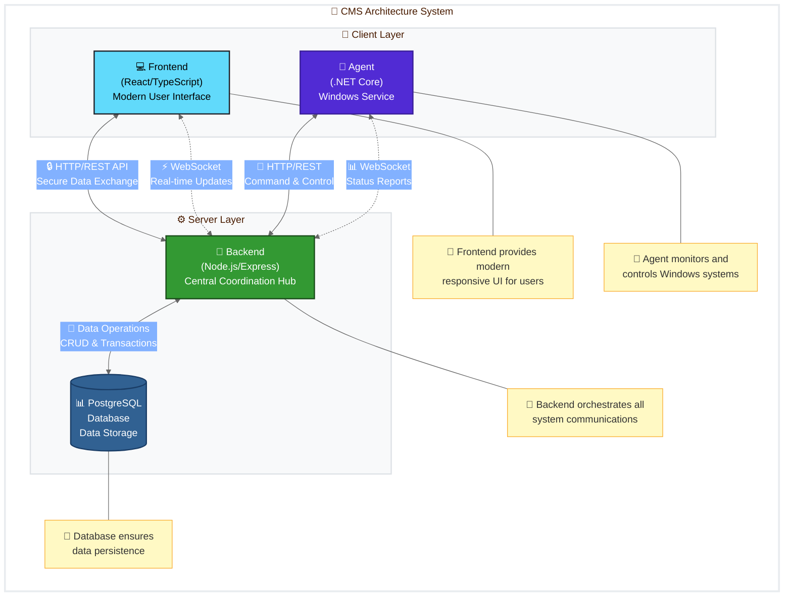
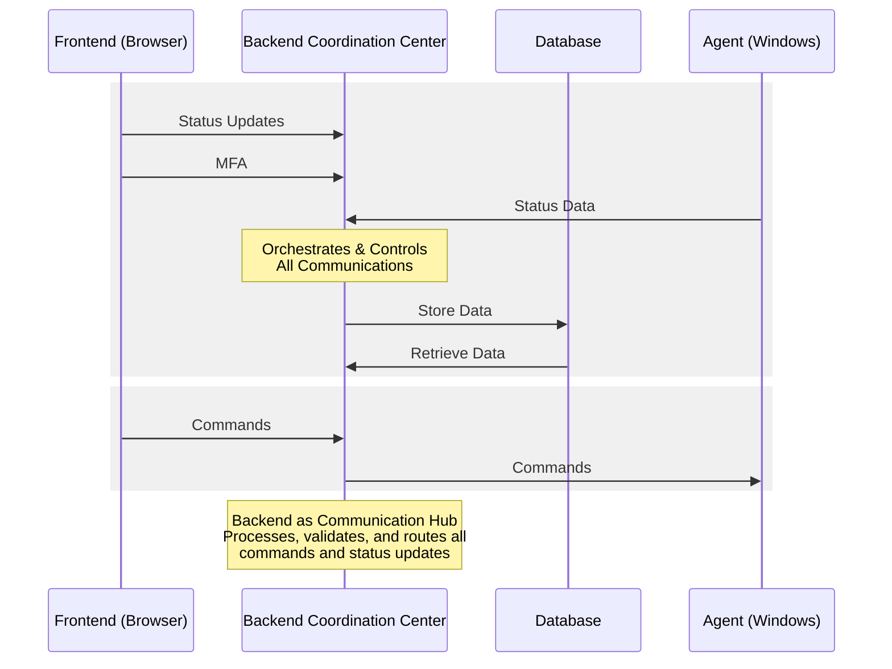

# Computer Management System (CMS)

<div align="center">
  <h3>A comprehensive solution for enterprise computer management</h3>
</div>
## Overview

The Computer Management System (CMS) is a robust web application designed to manage, monitor, and control computers within an organization. Built on a centralized architecture with Backend as the coordination hub, the system orchestrates communication between the user interface and client computers. The Backend serves as the command center that processes all operations, providing real-time tracking of operational status, secure remote command execution, and comprehensive asset management capabilities.

<div align="center">
  


</div>

## 📋 Table of Contents

- [Features](#features)
- [System Architecture](#system-architecture)
- [Technologies](#technologies)
- [Project Structure](#project-structure)
- [Setup & Installation](#setup--installation)
  - [Prerequisites](#prerequisites)
  - [Backend Setup](#backend-setup)
  - [Frontend Setup](#frontend-setup)
  - [Agent Setup](#agent-setup)
- [Running the Project](#running-the-project)
- [API Overview](#api-overview)
- [Configuration](#configuration)
- [Documentation](#documentation)
- [Contributing](#contributing)
- [License](#license)

---

## Features

The CMS offers a robust set of features for effective computer asset management:

### 🖥️ Real-time Computer Monitoring

- **Live Status Tracking**: Monitor online/offline status via WebSocket connection
- **Resource Monitoring**: Track system metrics (CPU, RAM usage) in real-time
- **Hardware Inventory**: Collect and display detailed hardware information (OS, CPU, GPU, RAM, disk)

### 🏢 Room-based Management

- **Logical Grouping**: Organize computers into virtual "Rooms"
- **Visual Layout**: Display computers in a spatial layout within each room

### 🔄 Remote Control

- **Command Execution**: Send console commands or system actions to remote computers
- **Real-time Feedback**: View command execution results as they happen

### 👥 User Management

- **Role-based Access**: Administrator and User roles with appropriate permissions
- **Granular Control**: Admins manage the entire system while Users access assigned rooms/computers

### 🔒 Secure Agent Registration

- **Multi-Factor Authentication**: Enhanced security with MFA for new Agent registration
- **Token Authentication**: Secure communications using Agent Tokens

### ❗ Error Management

- **Error Reporting**: Agents report system errors to the central server
- **Resolution Workflow**: View, manage, and mark errors as resolved through the interface

### 🔍 Advanced Search & Filtering

- **Comprehensive Filtering**: Filter users, rooms, and computers by multiple criteria
- **Fast Search**: Quickly locate specific resources in the system

### 🔄 Automatic Updates

- **Self-updating Agent**: Agents automatically check for and install new versions
- **Version Management**: Admin interface for uploading and marking stable agent versions

### 📊 System Statistics

- **Admin Dashboard**: Get an overview of system status and health
- **Key Metrics**: Track users, rooms, computers, online/offline status, and error states

### 💻 Modern Interface

- **React & Ant Design**: Clean, responsive user interface for optimal user experience

## System Architecture

The CMS implements a hub-and-spoke architecture with Backend as the central coordination system:

<div align="center">



</div>

### 🔙 Backend (Node.js/Express.js)

- **Centralized Coordination Hub**: Acts as the orchestration center for the entire system
- **Two-way Command & Control**: Manages bidirectional communication between Frontend and Agent
- **Data Processing Center**: Handles all business logic and data management operations
- **API Gateway**: Provides RESTful APIs for both Frontend and Agent interactions
- **Real-time Communication**: Manages WebSocket (Socket.IO) connections for instant updates
- **Security Control**: Handles authentication, authorization, and access control
- **System Monitoring**: Tracks agent status and system health

### 🖌️ Frontend (React/Vite)

- Web-based user interface for system interaction
- Communication with Backend via REST APIs and WebSocket
- Data visualization including room layouts and computer statuses
- Administrative tools and dashboards

### 🤖 Agent (Windows Service - .NET)

- Client application running as a Windows Service on managed computers
- System information collection (hardware specs, resource utilization)
- Secure communication with the Backend Server (HTTPS for API, WSS for WebSocket)
- Remote command execution and automatic updates

## Technologies

### Backend

- **Runtime**: Node.js
- **Framework**: Express.js
- **Database**: PostgreSQL
- **ORM**: Sequelize
- **Real-time**: Socket.IO
- **Authentication**: JWT, bcrypt.js
- **Security**: otp-generator for MFA
- **Logging**: Winston
- **Development**: dotenv, nodemon

### Frontend

- **Framework**: React with Vite
- **UI Library**: Ant Design
- **Styling**: Tailwind CSS
- **HTTP Client**: Axios
- **Real-time**: Socket.IO Client
- **Routing**: React Router DOM
- **State Management**: React Context API
- **Notifications**: React Hot Toast

### Agent (CMSAgent)

- **Platform**: .NET (C#)
- **Communication**: SocketIOClient.Net, HttpClient
- **Logging**: Serilog
- **Windows Service**: Microsoft.Extensions.Hosting.WindowsServices
- **CLI**: System.CommandLine
- **Packaging**: Inno Setup

### Database

- **PostgreSQL** with automated setup script

## Project Structure

The project is organized into three main modules: Backend, Frontend, and Agent.

<details>
<summary><b>📂 Expanded Project Structure</b></summary>

```
computer-management-system/
├── package.json              # Main project dependencies and scripts
├── README.md                 # Project documentation
│
├── backend/                  # Backend Server source code
│   ├── create_db.sh          # Database creation script
│   ├── package.json          # Backend dependencies and scripts
│   └── src/
│       ├── app.js            # Express app and Socket.IO initialization
│       ├── server.js         # HTTP server startup and database connection
│       ├── config/           # Configuration files (database, auth)
│       ├── controllers/      # Request handlers and service callers
│       ├── database/         # Sequelize models, migrations, seeders
│       ├── middleware/       # Authentication and permission middleware
│       ├── routes/           # API endpoint definitions
│       ├── services/         # Core business logic implementation
│       ├── sockets/          # WebSocket event handling
│       └── utils/            # Utility functions and modules
│
├── frontend/                 # Frontend Application source code
│   ├── package.json          # Frontend dependencies and scripts
│   ├── vite.config.js        # Vite configuration
│   ├── index.html            # Root HTML file
│   └── src/
│       ├── App.jsx           # Root application component
│       ├── main.jsx          # React application entry point
│       ├── assets/           # Static assets (images, icons)
│       ├── components/       # Reusable UI components
│       ├── contexts/         # React Context providers
│       ├── hooks/            # Custom React hooks
│       ├── layouts/          # Page layout components
│       ├── pages/            # Page components
│       ├── router/           # Routing configuration
│       └── services/         # API communication services
│
└── agent/                    # CMSAgent (.NET) source code
    ├── CMSAgent.sln          # .NET solution file
    ├── README.md             # Agent documentation
    ├── build.ps1             # Installer build script
    ├── build-update.ps1      # Update package build script
    ├── src/                  # Source code
    │   ├── CMSAgent/         # Main Agent implementation
    │   ├── CMSUpdater/       # Self-update implementation
    │   ├── CMSAgent.Common/  # Shared library
    │   └── Setup/            # Installation packaging
    └── docs/                 # Architecture documentation
```

</details>

Each module follows best practices for its respective technology stack:

- **Backend**: RESTful API design, service-oriented architecture, and middleware patterns
- **Frontend**: Component-based architecture with React hooks and contexts
- **Agent**: .NET service architecture with modular components

## Setup & Installation

### Prerequisites

Before setting up CMS, ensure you have the following installed:

| Component  | Minimum Version    | Notes                  |
| ---------- | ------------------ | ---------------------- |
| Node.js    | 16.x or higher     | Includes npm           |
| PostgreSQL | 12.x or higher     | Required for database  |
| Git        | Any recent version | For cloning repository |

For Agent development:

- **.NET SDK**: 6.0 LTS or 8.0 LTS (check `agent/README.md` for specific version)
- **Inno Setup**: Required for building the installer package
- **PowerShell**: For running build scripts

### Backend Setup

<details>
<summary><b>📋 Detailed Backend Setup Instructions</b></summary>

1. **Clone Repository**

   ```bash
   git clone <your-repository-url>
   cd computer-management-system
   ```

2. **Install Dependencies**

   ```bash
   npm install
   ```

   This installs `concurrently` in the root and runs `npm install` in both `backend` and `frontend` directories.

3. **Configure Environment**

   ```bash
   cd backend
   cp .env.example .env  # If .env.example exists
   ```

   Edit `.env` with appropriate values:

   ```
   # Database Configuration
   DB_USER=myuser
   DB_PASSWORD=mypassword
   DB_NAME=mydatabase
   DB_HOST=localhost
   DB_PORT=5432

   # JWT Configuration
   JWT_SECRET=cms-super-secret-key-please-change-me
   JWT_EXPIRES_IN=24h

   # Server Configuration
   PORT=3000

   # Client URL (for CORS)
   CLIENT_URL=http://localhost:5173
   ```

4. **Set Up Database**
   ```bash
   ./create_db.sh                  # Create database and user
   npx sequelize-cli db:migrate    # Set up tables
   npx sequelize-cli db:seed:all   # (Optional) Add sample data
   ```
   </details>

### Frontend Setup

<details>
<summary><b>📋 Frontend Configuration</b></summary>

1. **Configure Environment**
   ```bash
   cd frontend
   ```
   Create a `.env` file with:
   ```
   VITE_API_URL=http://localhost:3000
   ```
   </details>

### Agent Setup

<details>
<summary><b>📋 Agent Build & Installation</b></summary>

1. **Build Agent**

   - Open `agent/CMSAgent.sln` with Visual Studio
   - Build in Release mode, or use:

   ```powershell
   cd agent
   ./build.ps1  # Will prompt for version number
   ```

2. **Install on Client Machine**
   - Run generated installer with Admin privileges
   - Follow setup wizard and configuration prompts
   - Agent configuration will be stored in: - `C:\ProgramData\CMSAgent\runtime_config\runtime_config.json` - `C:\Program Files\CMSAgent\appsettings.json`
   </details>

## Running the Project

<div align="center">

### Development Mode

</div>

**Run Full Stack (Backend + Frontend)**

```bash
npm run dev
```

**Run Backend Only**

```bash
cd backend
npm run dev
```

**Run Frontend Only**

```bash
cd frontend
npm run dev
```

<div align="center">

### Production Mode

</div>

**Backend**

```bash
cd backend
npm start
```

**Frontend**

```bash
cd frontend
npm run build
# Serve the built files with your preferred static file server
```

## API Overview

CMS provides a comprehensive API for both Frontend and Agent communication.

<details>
<summary><b>🌐 Frontend API Endpoints</b></summary>

| Endpoint                     | Description                  | Access Control          |
| ---------------------------- | ---------------------------- | ----------------------- |
| `/api/auth`                  | Authentication and user info | -                       |
| `/api/users`                 | User management (CRUD)       | Admin only              |
| `/api/rooms`                 | Room management              | Admin or assigned users |
| `/api/computers`             | Computer management          | Admin or room access    |
| `/api/admin/stats`           | System statistics            | Admin only              |
| `/api/admin/agents/versions` | Agent version management     | Admin only              |

</details>

<details>
<summary><b>🤖 Agent API Endpoints</b></summary>

| Endpoint                              | Description               |
| ------------------------------------- | ------------------------- |
| `/api/agent/identify`                 | Register/identify agent   |
| `/api/agent/verify-mfa`               | Verify MFA for new agents |
| `/api/agent/hardware-info`            | Send hardware information |
| `/api/agent/report-error`             | Report computer errors    |
| `/api/agent/check-update`             | Check for agent updates   |
| `/api/agent/agent-packages/:filename` | Download update packages  |

</details>

### WebSocket Communication

<div align="center">



</div>

- **Backend as Communication Hub**

  - Orchestrates all data flow between Frontend and Agent
  - Processes, validates, and routes all commands and status updates
  - Maintains real-time state of the entire system

- **Frontend WebSocket Events**

  - Receives: Computer status updates, command results, MFA notifications
  - Sends: Command execution requests to Backend for validation and routing

- **Agent WebSocket Events**
  - Receives: Validated command execution requests, version update notifications
  - Sends: Resource status updates, command execution results for Backend processing

For detailed API documentation including request/response schemas, see:
[Complete API Documentation](/backend/docs/api_document.md)

## Configuration

<details>
<summary><b>⚙️ Configuration Files</b></summary>

### Backend

- **`.env`**: Environment variables
  ```
  DB_USER, DB_PASSWORD, DB_NAME, DB_HOST, DB_PORT
  JWT_SECRET, JWT_EXPIRES_IN
  PORT, CLIENT_URL
  ```
- **`src/config/db.config.js`**: Sequelize database configuration
- **`src/config/auth.config.js`**: Authentication configuration

### Frontend

- **`.env`**: Environment configuration
  ```
  VITE_API_URL=http://localhost:3000
  ```

### Agent

- **`appsettings.json`**: Main operational configuration
  - Server URL
  - Reporting intervals
  - Resource thresholds
  - Logging settings
- **`runtime_config.json`**: Machine-specific configuration
  - Agent ID and token
  - Room assignment
  - Position coordinates
  </details>

## Documentation

The following resources provide detailed information about different aspects of the CMS:

| Document                                                               | Description                  |
| ---------------------------------------------------------------------- | ---------------------------- |
| [Backend API Documentation](/backend/docs/api_document.md)             | Comprehensive API reference  |
| [Agent README](/agent/README.md)                                       | Agent overview and setup     |
| [Agent Architecture](/agent/docs/Structure.md)                         | Detailed agent architecture  |
| [Agent Comprehensive Guide](/agent/docs/CMSAgent_Comprehensive_Doc.md) | In-depth agent documentation |
| [Agent Workflows](/agent/docs/Flow.md)                                 | Agent communication flows    |

## Contributing

We welcome contributions to the Computer Management System! Please contact the project maintainer for contribution guidelines.

## License

© 2025 Computer Management System. All rights reserved.

---

<div align="center">
<p>
<b>Computer Management System</b><br>
Streamlining IT management for organizations
</p>
</div>
